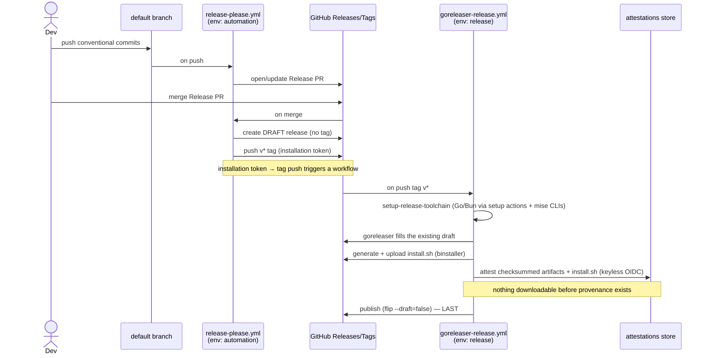
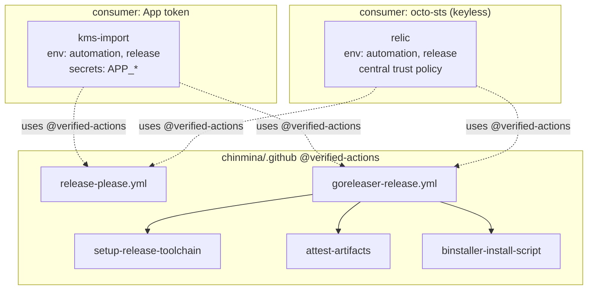

# chinmina shared release pipeline

Reusable workflows and composite actions that give consuming repositories a
near-zero-config, supply-chain-hardened release: release-please draft-gate,
goreleaser build, keyless provenance attestation, and a build → attest → publish
gate that keeps assets non-downloadable until their provenance exists.

Consumers pin everything to **`@verified-actions`** (fast-forwarded only to
reviewed commits). Third-party actions inside this repo are SHA-pinned; the
first-party kit references ride `@verified-actions` (encoded as zizmor policy in
[`../.github/zizmor.yml`](../.github/zizmor.yml)).

## Components

| Artifact | Kind | Purpose |
|----------|------|---------|
| [`release-please.yml`](../.github/workflows/release-please.yml) | reusable workflow | Trigger half: open/update the Release PR, then create a draft release + push the `v*` tag with a minted installation token (App **or** octo-sts). |
| [`goreleaser-release.yml`](../.github/workflows/goreleaser-release.yml) | reusable workflow | goreleaser build → attest → publish wrapper. Serves both Go and Bun projects. |
| [`setup-release-toolchain`](../.github/actions/setup-release-toolchain/) | composite | One upfront toolchain install: mise CLIs in a single cached pass, plus Go/Bun via their setup actions with versions resolved from mise. |
| [`attest-artifacts`](../.github/actions/attest-artifacts/) | composite | Keyless build-provenance for the checksummed artifacts (+ `install.sh`). |
| [`binstaller-install-script`](../.github/actions/binstaller-install-script/) | composite | Generate + attach an attestable `install.sh`. |

> One `goreleaser-release.yml` covers both Go and Bun projects — goreleaser
> builds both, so there is no separate Bun wrapper. The npm channel is on by
> default (via the `npm-publish` action); opt out with `disable-npm: true`.

## Token sources

`release-please.yml` mints a GitHub App **installation** token (so the tag push
re-triggers the build) from one of two sources, selected per repo via
`token-source`:

- **`app`** (default) — chinmina GitHub App. Needs env-scoped secrets
  `RELEASE_PLEASE_CLIENT_ID` + `RELEASE_PLEASE_APP_PRIVATE_KEY`. Scoped to
  `contents:write` + `pull-requests:write`.
- **`octo-sts`** — keyless OIDC federation. No stored key. The job runs in the
  `automation` environment, so the OIDC subject is environment-qualified. Trust
  policies are **centralised in the org's `.github` repo** (octo-sts `scope`
  defaults to the org), so a consumer cannot author its own policy. Per-repo
  identities are auto-derived:
  - `release-please.yml` → `release-please-<repo>` (subject
    `…:environment:automation`, typically pinned to `refs/heads/main`).
  - `goreleaser-release.yml` (`token-source: octo-sts`) → `release-<repo>` for the
    app-repo write (subject `…:environment:release`, pinned to `v*` tags) and
    the shared `release-tap` for the Homebrew tap write — so the tap needs **no
    stored PAT** on this path. The App path keeps using
    `HOMEBREW_GITHUB_TOKEN`.

## Environments

Named in the reusable workflows, resolved in the consumer:

- `automation` — the release-please job.
- `release` — the build/attest/publish job.

Each consumer owns these environments, their protection rules, and their
environment-scoped secrets; `secrets: inherit` carries them in. **A referenced
environment that does not exist is auto-created _ungated_** — so per-repo
environment configuration is a migration gate, not a centralised guarantee.

## Release sequence



## Component map



## Workflow contracts

### `release-please.yml`

| | |
|---|---|
| **Inputs** | `token-source` (`app`\|`octo-sts`, default `app`), `config-file`, `manifest-file`, `sts-identity` |
| **Secrets** | via `inherit`: `RELEASE_PLEASE_CLIENT_ID`, `RELEASE_PLEASE_APP_PRIVATE_KEY` (app path only) |
| **Job env** | `automation` |
| **Permissions** | `contents: read`, `id-token: write` (writes use the minted token) |

### `goreleaser-release.yml`

| | |
|---|---|
| **Trigger** | consumer's `push: tags: ['v*']` caller |
| **Inputs** | `pre-build`, `disable-binstaller`, `disable-homebrew`, `disable-docker-login` (default `false`), `extra-mise-tools`, `binstaller-spec`, `token-source` (`app`\|`octo-sts`), `sts-scope`, `sts-release-identity`, `sts-tap-identity`, `disable-npm` (default `false` — npm on), `npm-package-name` (required unless npm off), `npm-main-package-dir`. Tool versions (Go, goreleaser, binstaller, optional Bun/cosign) come from the consumer's mise config — no version inputs. |
| **Secrets** | via `inherit`: `HOMEBREW_GITHUB_TOKEN` (App path + homebrew only; octo-sts mints the tap token instead); `DOCKERHUB_TOKEN` (Docker/ko login on — the default) |
| **Variables** | `DOCKERHUB_USER` (Docker/ko login on; read from `vars`, no `inherit` needed) — both scoped to the `release` environment |
| **Job env** | `release` |
| **Permissions** | `contents: write`, `id-token: write`, `attestations: write` |
| **Consumer release-please** | `release-please-config.json` must set `"draft": true` **and** `"include-component-in-tag": false` (validated / relied on by `release-please.yml`; the pinned action has no `draft` input) |
| **Consumer goreleaser** | `release.draft: true` + `mode: keep-existing` + `use_existing_draft: true` (all three; preflighted); homebrew via `homebrew_casks:` with `skip_upload: auto`; codegen in `before.hooks` |

## Quality gate

Run from the repo root (tools via [`mise.toml`](../mise.toml)):

```sh
mise exec -- actionlint
mise exec -- zizmor .
```

Adopting the pipeline in a new repo: follow the step-by-step
[**consuming-repo guide**](adopting-the-release-pipeline.md), with a fully
worked instance in [`examples/`](examples/).
