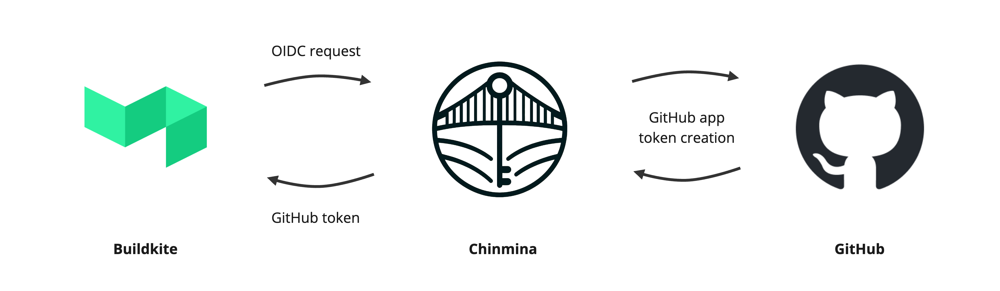

# Chinmina

Chinmina hosts [chinmina-bridge](https://github.com/chinmina/chinmina-bridge) and its related tools — a set of open source projects for securing Buildkite-to-GitHub access using short-lived tokens.

## chinmina-bridge

Buildkite pipelines need to check out code from GitHub. Traditionally this means storing Personal Access Tokens or deploy keys — long-lived credentials that require ongoing management and create unnecessary risk.

Chinmina Bridge is a self-hosted Go service that eliminates both. Buildkite agents authenticate to it using [Buildkite OIDC](https://buildkite.com/docs/agent/v3/cli-oidc) tokens. Chinmina Bridge validates the request and calls the GitHub API to vend a short-lived installation token scoped to the pipeline's repository. Tokens expire within an hour. Nothing is stored per repository.

One GitHub App installation covers the entire organization. The private key can be stored in AWS KMS so it is never exposed to the running service. Structured audit logs record every token request, whether successful or not.

Beyond basic checkout access, _profiles_ allow additional permissions to be declared centrally: pipeline profiles grant elevated access to the pipeline's own repository, and organization profiles grant access to other repositories in the organization (private Buildkite plugins, Homebrew taps, and so on).

## Repositories

| Repository | Description |
|---|---|
| [chinmina-bridge](https://github.com/chinmina/chinmina-bridge) | The bridge service — a containerized Go HTTP service with 12-factor configuration |
| [chinmina-git-credentials-buildkite-plugin](https://github.com/chinmina/chinmina-git-credentials-buildkite-plugin) | Buildkite plugin that configures Git credential helper integration for seamless repository checkout |
| [chinmina-token-buildkite-plugin](https://github.com/chinmina/chinmina-token-buildkite-plugin) | Buildkite plugin for retrieving GitHub tokens from Chinmina, exported as environment variables or via a helper script |
| [iamcacheauth](https://github.com/chinmina/iamcacheauth) | AWS IAM authentication token generator for ElastiCache and MemoryDB (Redis and Valkey), usable with any Redis-compatible Go client |
| [chinmina.github.io](https://github.com/chinmina/chinmina.github.io) | Source for the documentation site at [docs.chinmina.dev](https://docs.chinmina.dev) |

## Getting started

Full setup instructions are in the [getting started guide](https://docs.chinmina.dev/guides/getting-started/). A working installation requires a Buildkite API token, a GitHub App with `contents:read` permission installed into the organization, and a host reachable by the Buildkite agents.

The [contribution guide](https://docs.chinmina.dev/contributing/) covers how to contribute to any repository in this organization.
